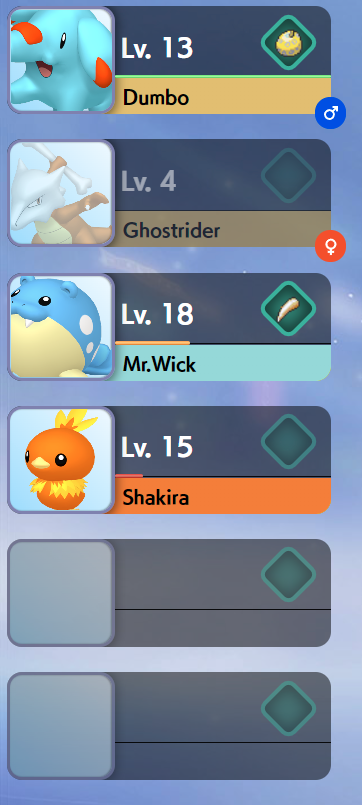

#  Unite Team List
This is a theme built by [Jezzabel](https://twitter.com/ThatStreamerJez)

## Preview

## Features
 - **Subtle HP Bars** are shown just above the Pokémon's name.
 - **Level** is shown next to the pokemon's sprite
 - **Gender** is shown next to the pokemon's sprite
 - **Full Generation Support** - All Pokémon who have a Pokémon home sprite will work using this theme.
 - **Health Bar** is shown in varying colours depending on the percentage of remaining health
 - **Animated Slot Switching** When switching pokemon in your party, the pokemon will slide out, then slide into their new respective slots.
 - **Fainted pokemon** When a pokemon faints, it will "grey-out".

## Settings

### Responsive layout
You can change this layout to be responsive (so it goes horizontal and stacks properly), just add `&responsive=true` in the URL